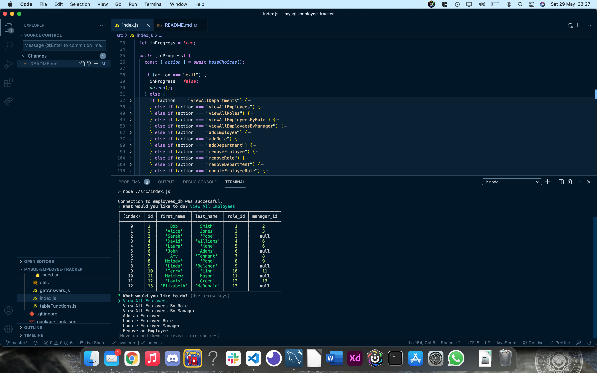

# MySQL Employee Tracker


## Table of Contents

- [MySQL Employee Tracker](#mysql-employee-tracker)
  - [Table of Contents](#table-of-contents)
  - [Description](#description)
  - [Installation](#installation)
  - [Usage](#usage)
  - [Licence](#licence)
  - [Video Demonstration](#video-demonstration)
  - [Tests](#tests)
  - [Screenshots](#screenshots)

## Description

For this project, I was given the task of creating an Employee Tracker app which uses MySQL and Inquirer in order for a user to create, read, update and delete employees, roles and departments from the tracker, and display them in a table, using console.table.

I had to ensure that the app connected to the employee database which was running using MySQL, so we could retrieve and amend any data as the user required.

Some of the functionality of this app includes:

- Viewing employees in the database. This included being able to view them all together, or filtering via manager or job role.
- Viewing all the roles and departments stored in the same database but on different tables.
- Being able to add further information to the database, this included adding new employees, roles or departments and prompting the user for more information if required.
- Updating employees roles & managers should the need arise.
- Removing data from the database and all information linked to it, for example, when you remove an employee, you also remove information regarding their role and their manager.
- Obtaining the total budget for a department by adding all the combined salaries together.

## Installation

```
git clone git@github.com:LeeFarnell/mysql-employee-tracker.git
cd mysql-employee-tracker
npm install mysql inquirer console.table

```

## Usage

To use this app, you will need to use Inquirer, mySQL & console.table, so please ensure these are installed before use.

Use npm run start to create the connection to the database and launch the app.

## Licence

This content is licenced under the MIT Licence.
https://www.mit.edu/~amini/LICENSE.md

## Video Demonstration

https://drive.google.com/file/d/1sNj133xfQuu-OF1EOSJHqqZ53KaVwVlC/view?usp=sharing

## Tests

No tests are required for this app.

## Screenshots





